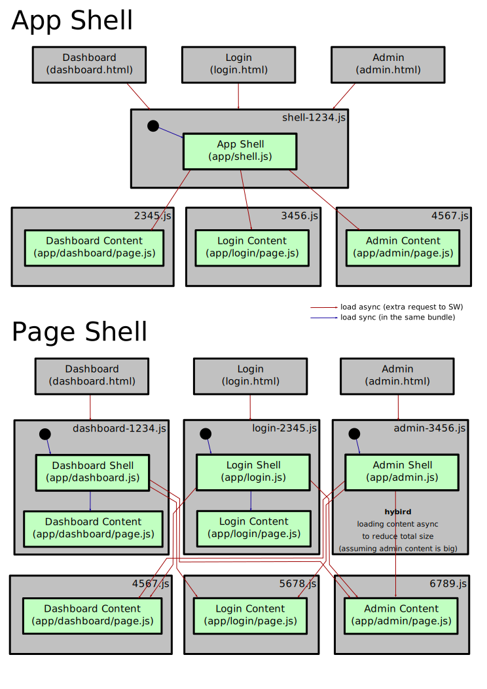

# webpack-pwa

Super simple webpack PWA example featuring

* Routing with **On Demand Loading**
* Offline support
* Feaching some data from network
* Two approaches
  * App Shell
  * Page Shell
* By intent: No framework, only simple JavaScript and DOM
  * Yes with `innerHTML` and `innerText`
  * Feel free to imagine your favorite framework here.

## Build and Run it

``` shell
npm install
npm run build-shell
cd dist
npm install node-static -g
static
open http://localhost:8080/dashboard.html
```

This builds the App Shell version.

To build the Page Shell version: replace `npm run build-shell` with `npm run build`.

## Architecture



### App Shell

* Total size is smaller
* Initial load requests three files: `login.html`, `shell-1234.js`, `3456.js`
* Router logic is not needed on initial load
* The shell is visible earlier than with Page Shell approach.

### Page Shell

* Total size is bigger (i. e. dashboard content is in `dashboard-1234.js` and `4567.js`)
* Initial load requests only two files: `login.html`, `login-2345.js`
* Router logic is not needed on initial load
* The shell + content is visible earlier than with App Shell approach.
